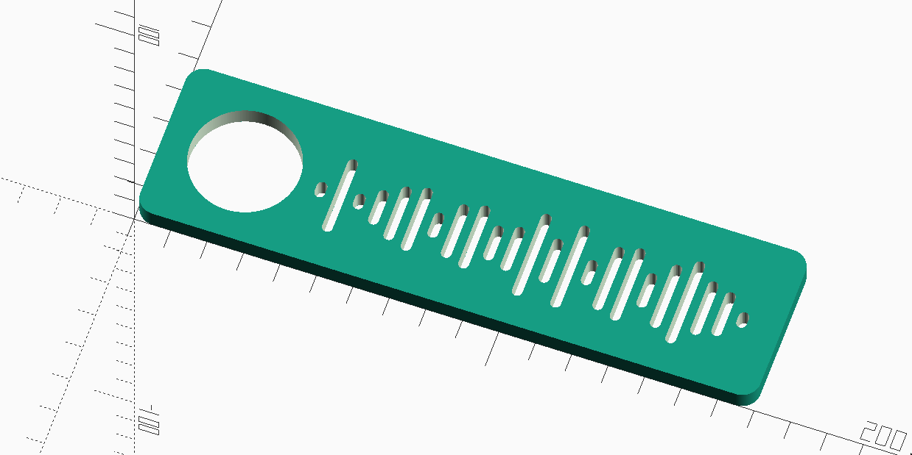

# Printable Spotify Code

1. download svg from https://www.spotifycodes.com/#create
2. run `sh remove-background.sh` to remove background from all svgs in dir
3. open spotify.scad and update `filename` to point your svg
4. export to stl and print
